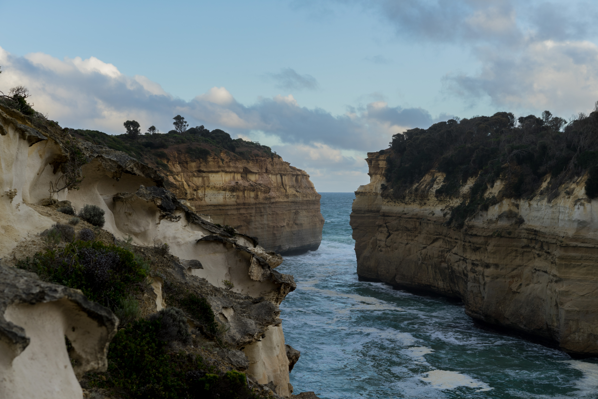
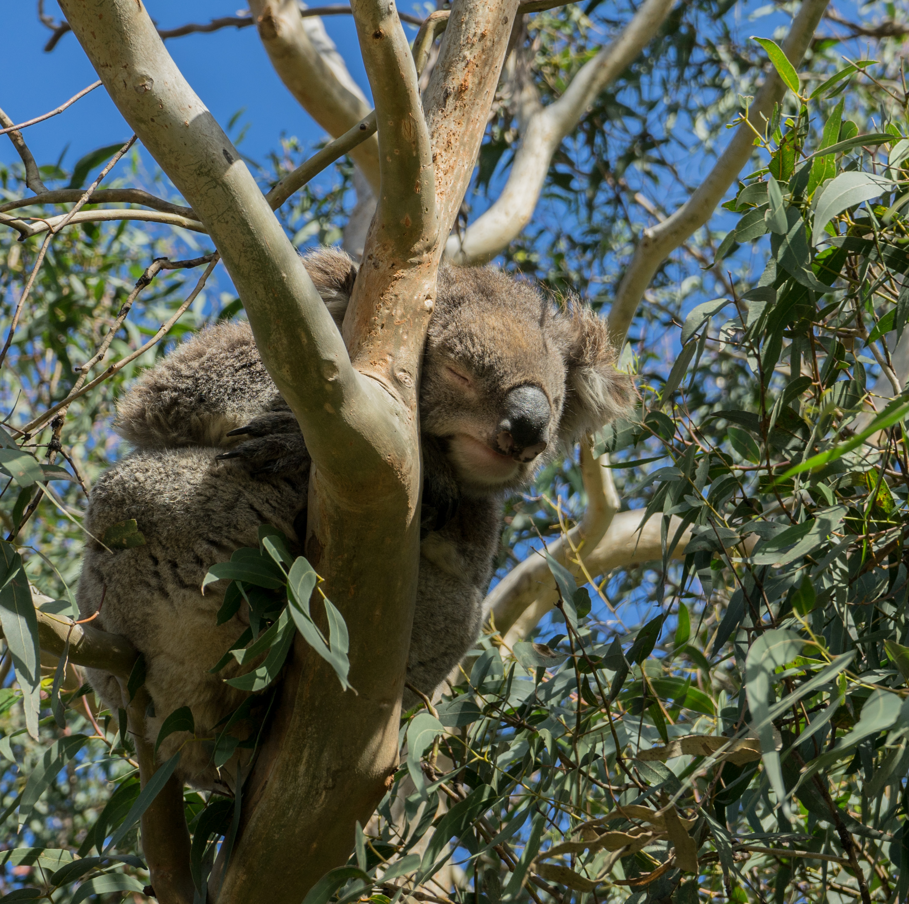

Back in 2016, I took a much-needed break from progressing on my university degree to work full-time at [Mineplex](https://www.mineplex.com/) - a multiplayer [Minecraft](https://en.wikipedia.org/wiki/Minecraft) network, and spend the rest of my time travelling. I enjoyed my time at Mineplex - working remotely with an extremely talented team based all around the world, we all quickly became friends as we spent time chatting on Slack and playing games together.

During my university hiatus, I had an exciting opportunity to travel to Australia and visit a few coworkers and friends that I met through Mineplex. To say it simply: I loved Australia. I originally booked my flights to stay there for one month, then that one month quickly turned into two.

Through the adventures with deadly spiders, hanging out with kangaroos, and almost being assaulted by a _mob_ of emus (yes - a group of emus is called a mob, and rightfully so), there is still one story from my trip that I love to tell regularly. This is my first time writing this story out in full. I thought that my blog would be the perfect place to share it. I added some photos that I took on the trip to give context. Here it goes.

During my last couple of weeks in Australia, my friend [Kira](https://www.youtube.com/user/kiraberryplays) (a Mineplex moderator, now YouTuber) and I thought it would be fun to go on a tour of the southern coastline of Australia, famously known as the Great Ocean Road. With plenty of beautiful sights along the 243 kilometers of coastal road, it’s no surprise that this road is an extremely popular tourist destination, with guided tours and camping trips going out daily.

We searched online and found a great deal on a one day guided tour along the road. We would get to see [The Twelve Apostles](https://en.wikipedia.org/wiki/The_Twelve_Apostles_(Victoria)) (pictured below - there were never actually twelve of them, but I’m sure the name helps with tourism), [Loch Ard Gorge](https://en.wikipedia.org/wiki/Loch_Ard_Gorge), [Maits Rest Rainforest](https://en.wikipedia.org/wiki/Maits_Rest), and more!

The tour company sent us back an email with instructions for the day of the tour: _"Meet on the front steps of St. Paul's Cathedral in downtown Melbourne at 8:00am to hop on the tour bus"_. Simple and easy, what could go wrong?

On the day of the tour, we wake up early, get all of our things together, and then hop on the train that would take us into the city. We were a bit worried about being late, so we rushed as quickly as we could, we even skipped an opportunity to grab some much-needed coffee to wake us up. Neither of us is an early riser, so we tried our best to entertain each other and avoid falling asleep.

After our hour-long train ride to Flinder's Street Rail Station, we quickly rushed towards the front steps of the Cathedral. The clock read 7:46am. We were early! Kira and I climbed the steps leading up to the entrance and waited.

We weren't sure who or what to look out for so we could rendezvous with the tour group, but we thought that we would figure it out as we went, and didn’t worry about it.

A few minutes later a man holding a clipboard walked up to us. _"Hi! Are you here for the Great Ocean Road tour?"_ Perfect! we thought. _"We are!"_.

The man told us to follow him as he led us to his white 8 passenger van. This came off as a bit of a surprise to us, we expected something a little bit bigger and with more people. He slid open the door of the van and we hopped in, joining the two other groups of people inside. Then, without saying a word, the man got into the driver seat of the car and we were off. The fact that it still wasn’t 8am crossed my mind for a brief second, but I brushed it off because leaving earlier meant more time to explore and enjoy the tour!

After about ten minutes of driving, the man pulled over at the side of the street, mumbled a few words, and then went inside of the residential building next to us. _“Where did he just go?”_ one of the other tour members asked. _“I think he said he would be back soon”_, another replied. I spent some time trying to parse out in my head what the man mumbled, I still don’t know to this day. I started to feel uncomfortable. Having gone on tours with my family in the past, I was used to the cheery tour guide persona; speaking loudly and clearly, excited to be there. This man did not exude any of those qualities.

Five minutes passed, and then another five. Everyone in the van started wondering what was going on. It wasn't until this moment that we realized the man never even asked us our names to make sure we bought tickets! I started getting a little anxious, but Kira assured me that everything was okay and we were on our way to a great tour.

We continued to wait for the man to come back when Kira's cell phone started ringing. She looked at the caller ID, and recognizing the number, decided to let the call go to voicemail. _"I don't know why my friend is calling me so early... strange"_. Still wondering what was going on, I had hoped that the phone call would give us some answers. Shortly after, the phone started ringing a second time, and the second time we dismissed the call. We continued waiting, still, the man didn't come back. A third time Kira's phone started ringing, the same number again! Something felt off to me, so I told Kira, _"alright, let's just answer it and see what's going on”_. I pick up the phone.

_"Howdy! This is Chris, your Great Ocean Road tour guide! Where are you guys?"._

_**Holy Shit.**_

As I'm on the phone talking to our tour guide, the others in the van with us start receiving calls as well, asking them where they are and why they hadn't shown up for their tours. It's hard to describe with words, but when realizing that you and some strangers are in an uncomfortable and possibly dangerous situation, something clicks in the brain, and everyone suddenly bands together to solve the problem as if you have known each other for years.

We unlocked and opened the sliding doors of the van, in such a hurry to get out and away from the van that we didn't even take the time to close the door behind us. We started working with our tour guide on the phone, using Google Maps to figure out where we were and trying to find a solution to meet up with the rest of the tour group.

We were lucky. Even though we were a bit of a drive away from our tour group, they offered to meet us at a pick-up point that was close to us so we could still make the tour. Once we arrived, we got into a normal-looking tour bus, with graphics on the sides of it, and lots of seats! I felt so relieved! Kira and I spent the rest of the day exploring the southern coastline of Australia. We got to see koalas, kangaroos, colourful birds, and even had some damn good ice cream.

After our tourism packed day, neither of us forgot how it started. In fact, it was the first story we told when we spoke to others about the trip when we returned. To this day, I still wonder what that man was thinking when he came back to his van to find the door left wide open and everyone gone.
